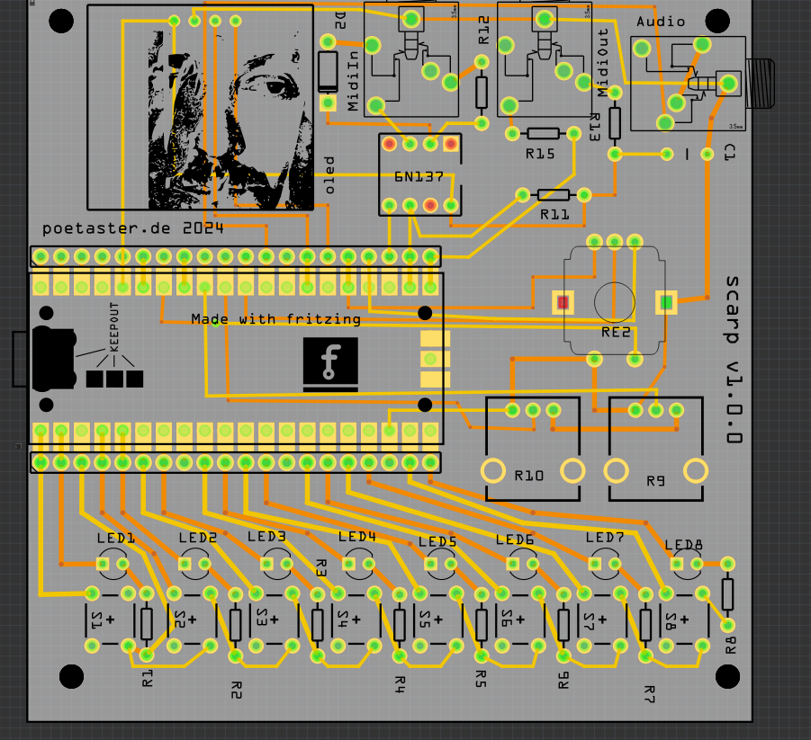
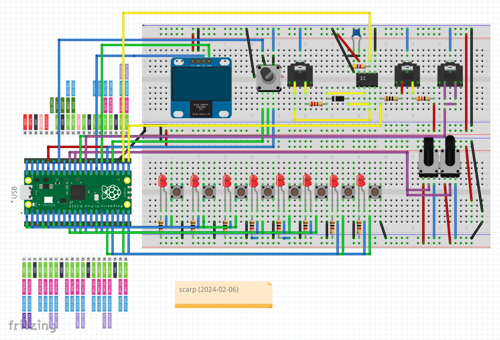

# scarp
Pikore redux Raspberry Pi Pico project to make a more midi centric pikocore with easier selection of some parameters.

I've had a bunch of fun with:

A Drum sequencer for the Pikocore, https://github.com/poetaster/PikoBeats, derived from https://github.com/rheslip/PikoBeats .

All playing on the Pikocore designed by Zack Scholl https://infinitedigits.co/wares/pikocore/ Please visit Zack's site to buy a Pikocore, a kit, or a PCB - its a really fun little sample glitcher.

But, when playing live with it, both bpm changes and voice changes on a pot are a pita. So, I thought I'd come up with a hybrid. 

THIS BOARD HAS NOT YET BEEN TESTED.

I'll post as soon as it's gone through production.

