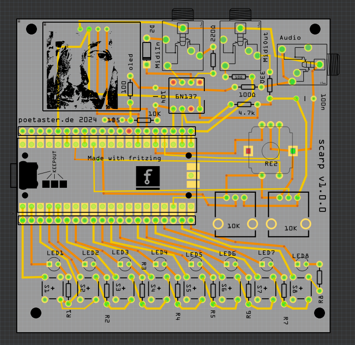

# scarp
The scarp project, named like it's brethren, rampart and keep (aka. moat) is an experimental, open hardware design. 

It can include a 4pin I2C display. Or a three pin I2S DAC. All the pins on the pico are exposed and you can add headers to use them.

The board uses all GPIO. 8 buttons, 8 leds, 2 pots and an encoder.

The firmware directory includes a number of types of firmware. You'll be able to do work with the bare pico sdk, circuitpython, or arduino. 

# firmwares
Include examples for
 *  Mozzi library based c++. 
 * Arduino PWM pikobeats variant. 
 * pikocore  The scarp branch here: https://github.com/poetaster/pikocore/tree/scarp allows you to play the pikocore firmware, with some tweaks to adapt to this hardware layout.
 * circuitpython - There is also an elaborate circuitpython audio example based on todbots https://github.com/todbot/picostepseq but including audio output ;)

 
I've had a bunch of fun with:

A Drum sequencer for the Pikocore, https://github.com/poetaster/PikoBeats, derived from https://github.com/rheslip/PikoBeats .

This project was inspired by Teenage Engineering, pikocore designed by Zack Scholl https://infinitedigits.co/wares/pikocore/, the todbot circuit python audio stuff and his layouts for a simple sequencer. Please visit Zack's site to buy a Pikocore, a kit, or a PCB - its a really fun little sample glitcher.

THIS BOARD is in production and the first version, with only pwm output works really well!.

